# Recreation.gov Demographic Analysis
1. [Overview](#overview)
2. [The Process](#the-process)
3. [Amazon AWS](#amazon-aws)
4. [Data Pipeline](#data-pipeline)
5. [Graph Class](#graph-class)
6. [EDA](#eda)
7. [Mesa Verde National Park](#mesa-verde-national-park)
8. [O'Haver Lake](#ohaver-lake)
9. [Conclusion](#conclusion)
10. [Sources](#sources)

## Overview

Every year, recreation.gov records every reservation on their site. These records contain information about each campsite/tour and some information about each customer. Specifically, each customer's state and zipcode are included. 

<br>**Goals** <br>
<li>Improve the recreation.gov product through a demographic analysis of their customers</li>
<li>Develop a pipeline that creates a database of census variables for a zip code </li>


To attack this question, I looked at two campsites in Colorado, Mesa Verde National Park and O'Haver Lake. I took more than 1300 census variables and subdivided them into clusters. 

<ul>
<li> Economics
<ul>
<li> Industry </li>
<li> Commute </li>
<li> Income </li>
<li> Health Insurance </li>
</ul>
</li>
<li> Social
<ul>
<li> Internet </li>
<li> Language </li>
<li> Education </li>
<li> Veteran Status </li>
</ul>
</li>
<li> Demographics
<ul>
<li> Age </li>
<li> Gender </li>
<li> Race </li>
</ul>
</li>
</ul>

For each cluster, I queried the census.gov api across all customer zip codes for each site. For each variable, I graphed my sample distribution against national average. For select variables, I conducted a hypothesis test to gain insight into the customer base for each sight. 


## The Process


I started with a little more than 1 million rows of reservation data from https://ridb.recreation.gov/download. I used docker and sparkbook to gather the columns I wanted to use (Site name, location & Customer location) for sites in Colorado and customers in the United States. Next, I cleaned the zipcodes and found corresponding Lat/Long points for each zipcode which would allow me to query the census api. 

I pushed this new dataset to Amazon S3 so that I could access the data on an Amazon EC2 instance and quickly query the api for each site and each census variable cluster. I opened a Amazon EC2 instance with much more memory and CPUs than my computer. I installed Docker and Sparkbook on the cloud and mapped my localhost:8881 to my instance's localhost:8881. With faster computation times, more census variables could be accessed across more zipcodes in a realistic time frame. I subdivided colorado sites into Mesa Verde National Park and O'Haver Lake, and collected data across census clusters. I pushed the new data to GitHub, pulled it into visualzation.py and graphed it using my Grapher class. 

## Amazon AWS

This project could not have happened without AWS. Early in my dataset creation process, I was paralized by slow computation when querying the census api for multiple sites. AWS came to the rescue, providing powerful tools for me to produce census data for multiple sites. I used the c4.8xlarge EC2 instance which provided me with 36 CPUs and 60 GiB of memory. On the instance, I installed Docker and Apache Spark which allowed me to maneuver my data. 

AWS drastically sped up the dataset generation portion of my project and allowed more time for anlaysis. It also created a great workflow where I would be generating data on the cloud and visualizing/statistically analyzing on my local machine while syncing up both sides with GitHub. 

## Data Pipeline

Each census cluster dataset was created using Apache Spark. This method was chosen due to a couple important characteristics of RDDs (Resilient Distributed Datasets)
<li> RDDs can recover from errors</li>
<li> RDDs are immutable </li>
<li> RDDs are lazily evaluated </li>

```python
spark = ps.sql.SparkSession.builder \
            .master("local[4]") \
            .appName("case study") \
            .getOrCreate()

sc = spark.sparkContext

## Data Pipeline
def add_census_tract(df):
    nparr = df.to_numpy()
    rdd = sc.parallelize(nparr)\
        .map(lambda row: row.tolist())\
        .map(lambda row: ap.add_census(row))
    ...

def add_census_data(census_data, cluster):
    rdd = sc.parallelize(census_data)\
        .map(lambda row: row.tolist())\
        .map(lambda row: ap.add_census_vars(row, cluster))
    ...


def add_census_vars(row, var_names):
    for i in range(len(var_names)):
        search_term = var_names[i][0]
        row.append(call_api(search_term, row))
    ...

def call_api(search_term, row):
    tract, state, county = row[5], row[6], row[7]
    query = "https://api.census.gov/data/2017/acs/acs5/profile?get=NAME,{}&for=tract:{}&in=state:{}%20county:{}&key={}".format(search_term, tract, state, county, key)
    try:
        call = requests.get(query).text
     ...
def export(df, fname, bucket):
    to_export = fname
    df.to_csv(to_export, header=True, index=True)
    s3_client.upload_file(to_export, bucket, to_export)
```
Large census api calls were made on each row. If an error was made in a single api call, it could have compromised my entire dataset. RDDs allowed me to fix errors before I ruined my whole dataset due to their immutable nature. I put together functions to call the api, but lazy evaluation allowed me to correct mistakes before they actually happened. 


## Graph Class

Once, the data creation process finished, I needed a way to statistically analyze my sample population against national average. 

```python
class Grapher(object):
    
    
    def __init__(self, hypo_test, data, cluster, fname, fig_rows, fig_cols, size_x, size_y):
        self.hypo_test = hypo_test
        self.data = data
        self.cluster = cluster
        self.fname = fname
        self.fig_rows = fig_rows
        self.fig_cols = fig_cols
        self.size_x = size_x
        self.size_y = size_y 
        
    def _national_means(self):
       ...
    
    def _national_call_api(self, search_term, ):
       ...

    def _national_distribution(self, search_term):
       ...

        
    def plot_cluster(self):
        fig = plt.figure(figsize=(self.size_x, self.size_y))
        if self.hypo_test:
            null_sample = self._national_distribution(search_term)
            self._plot_hypo_test(fig.add_subplot(self.fig_rows, self.fig_cols, 1), null_sample)
            ...
        else:
            national_mean = self._national_means()
            print(national_mean)
            for i in range(0, len(self.data.columns)):
                self._plot_hist(fig.add_subplot(self.fig_rows, self.fig_cols, i+1), self.data.iloc[:, i], self.data.columns[i], national_mean[i])
            ...

    def _plot_hist(self, ax, column, name, national):
       ...

    def _plot_hypo_test(self, ax, null_sample):
       ...
```
The grapher class takes in a site's sample poulation for a cluster, the cluster name, and graph characteristics and can provide the user with a histogram of census variables or a hypothesis test for a single census variable. In the class we tie in national averages for census variables to plot on histograms and national distributions for census variables to plot a hypothesis test. This class provides quick statistical analysis and I predict it will be reusable for more EDAs. 


## EDA

Customer Distance Traveled             |  Total Reservations
:-------------------------:|:-------------------------:
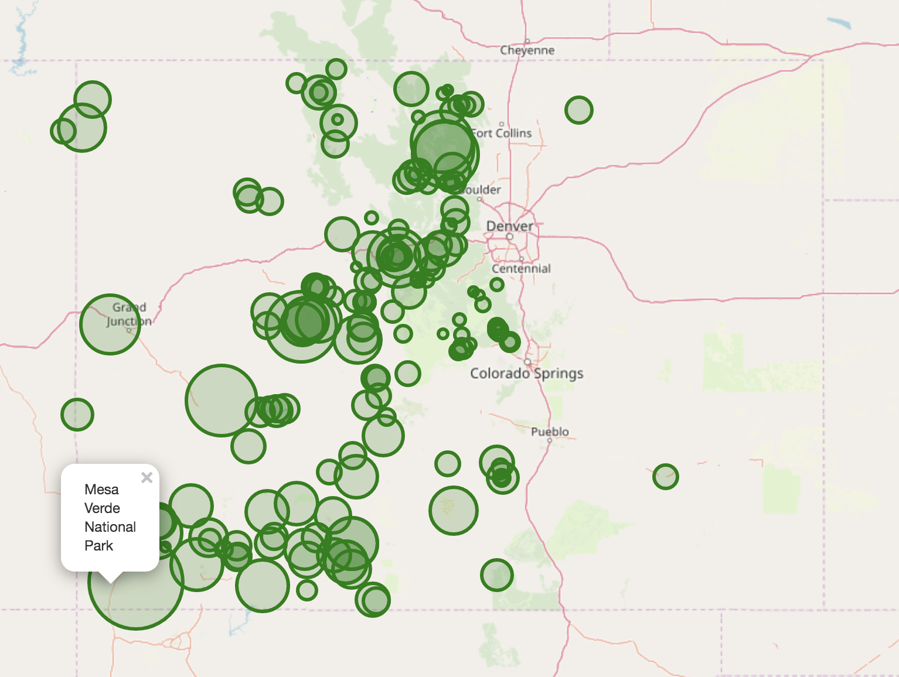  |  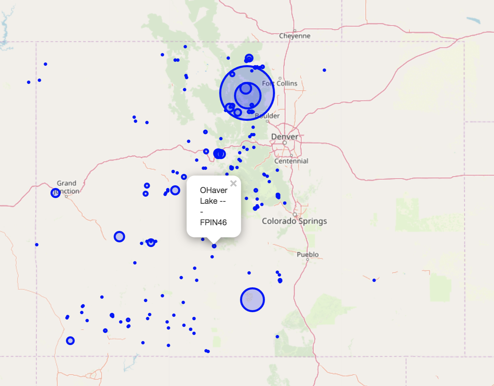


In deciding which campsites to further investigate, I considered a few factors. First, I wanted a campsite with a diverse clientele in terms of distance from the campsite. Clients from all over the country. Data generation also had to be kept in mind. Therefore, I also wanted a campsite with fewer reservations than normal, so I could collect a good amount of data to analyze. I settled on Mesa Verde National Park and O'Haver Lake. 

## Mesa Verde National Park          

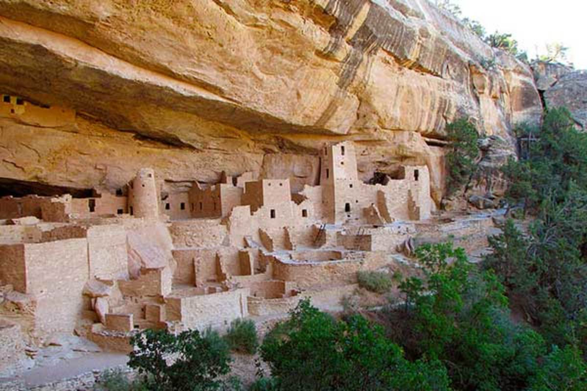  

Mesa Verde had over 1,000 reservations and customers from all over the country

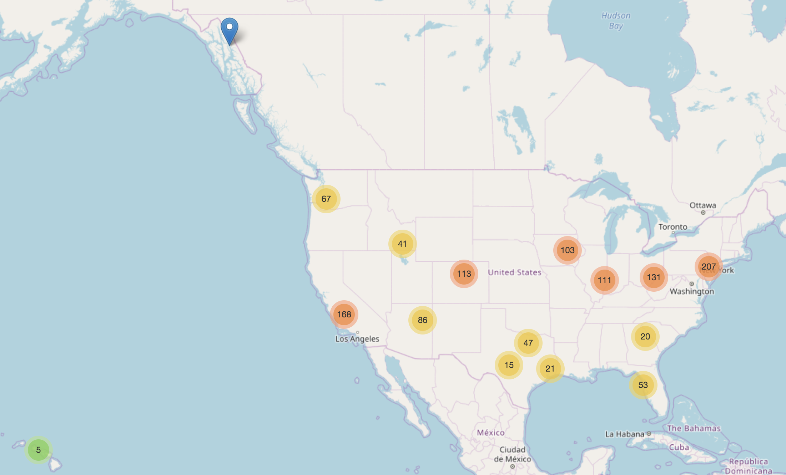  

Overall, it was difficult to come to any conclusions based on the census data of Mesa Verde's clientele...

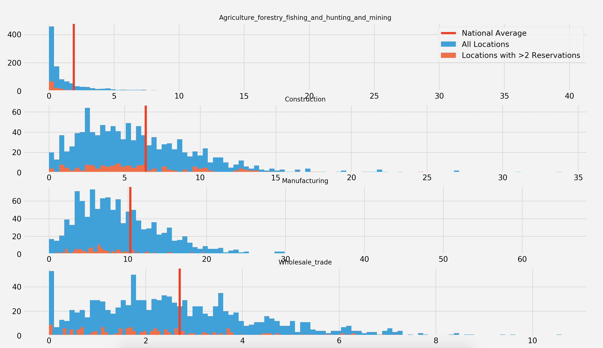  

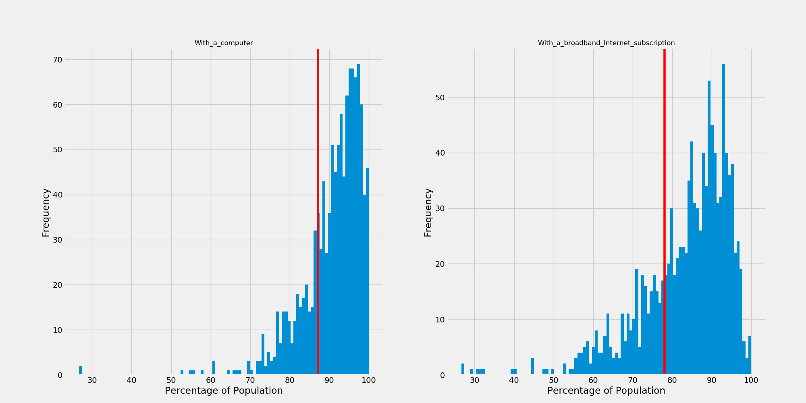  

I did have some questions:
<li> Did Mesa Verde's customers from places where people walked to work more often than national average? </li>
<li> What about public transportation? If people were using public transportation more than national average in these locations across the country, this could be a good advertising opportunity </li>

Walk          |  Public transportation 
:-------------------------:|:-------------------------:
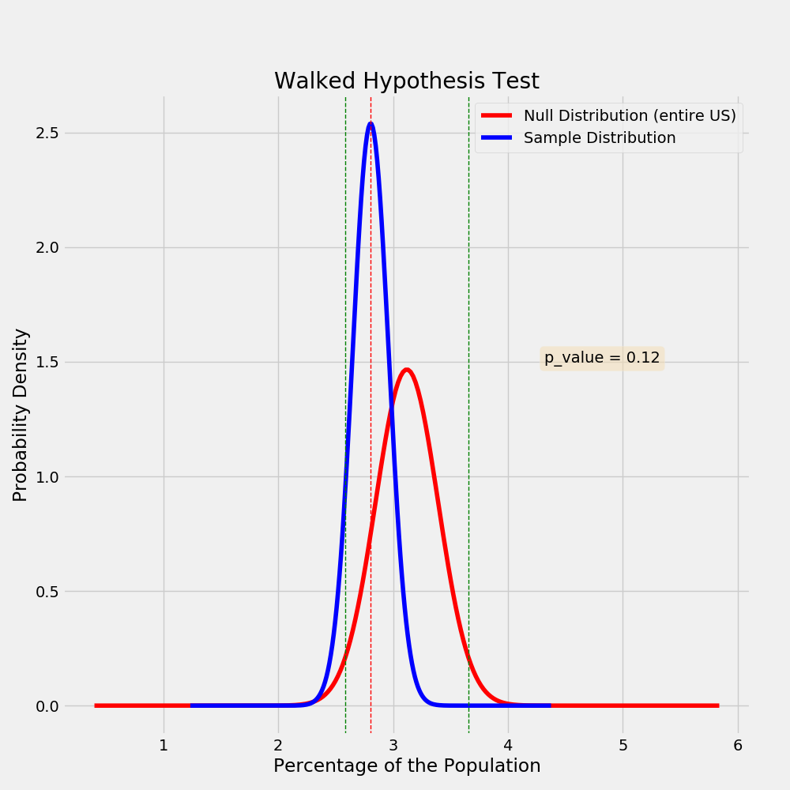  |  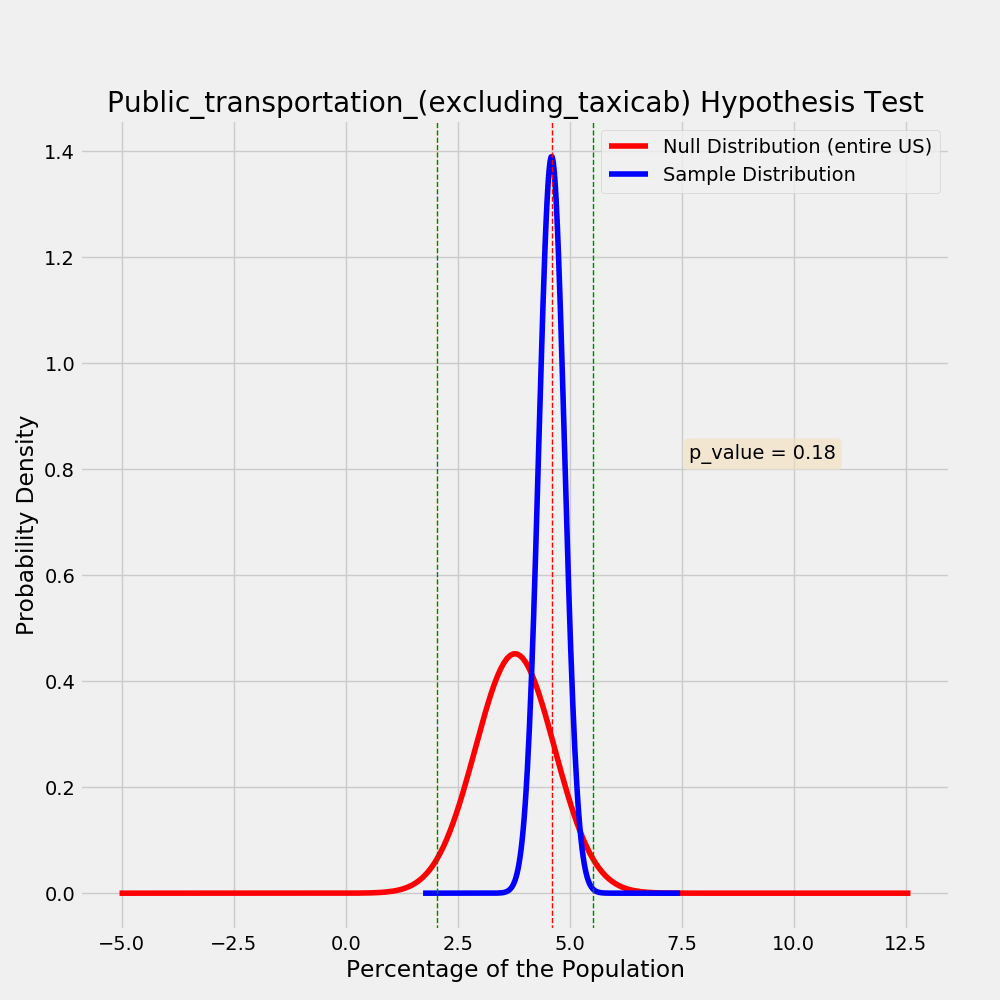


## O'Haver Lake

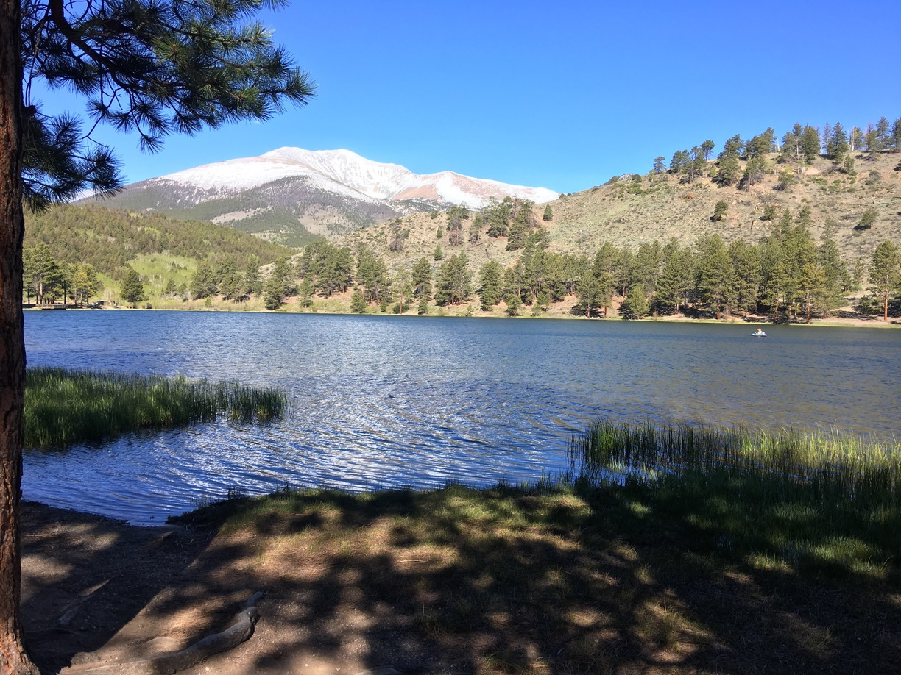  

O'Haver Lake had around 200 and customers mainly from Colorado

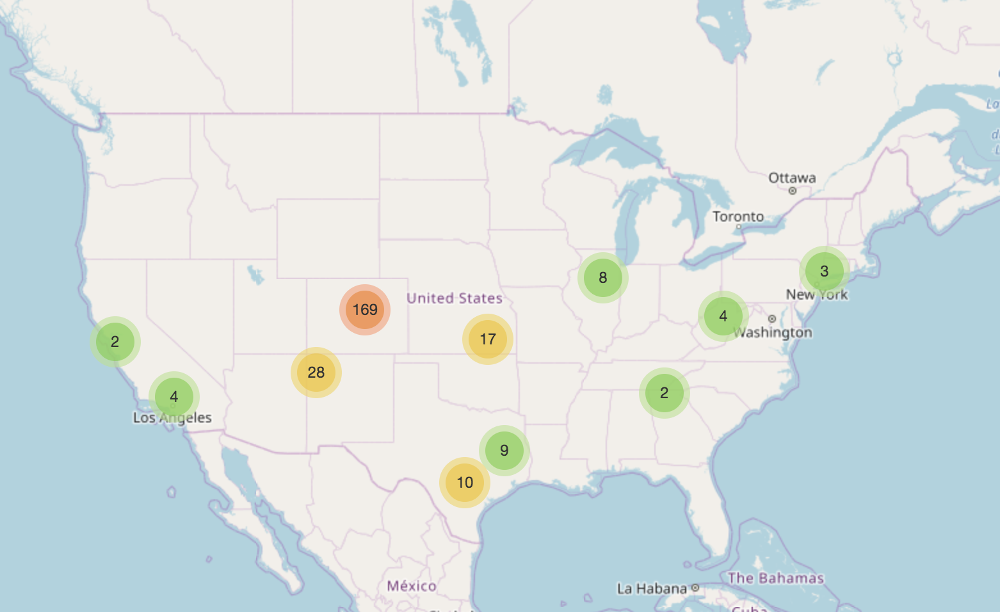  

Maybe we can make some conclusions... 

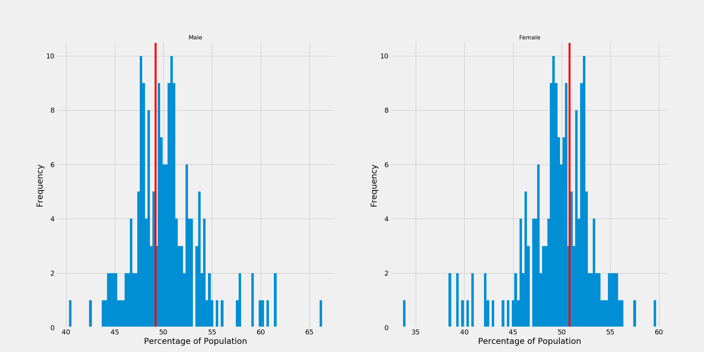  

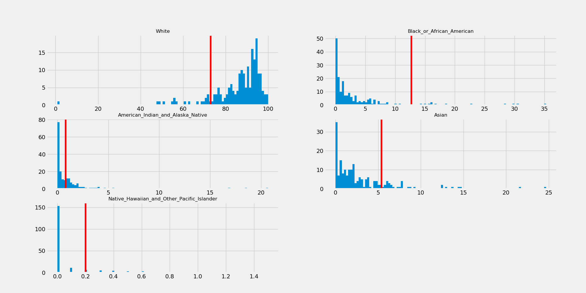 

Gender          |  Race 
:-------------------------:|:-------------------------:
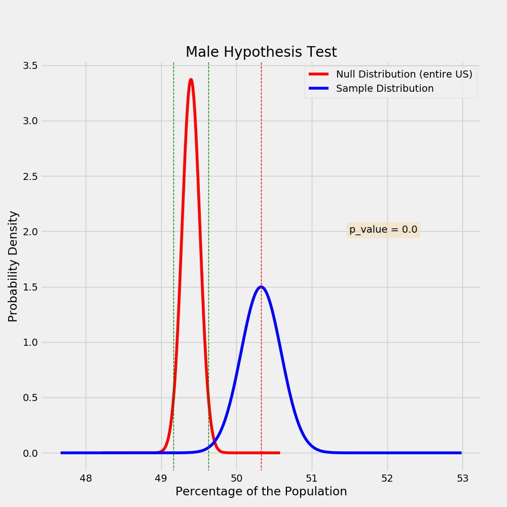  |  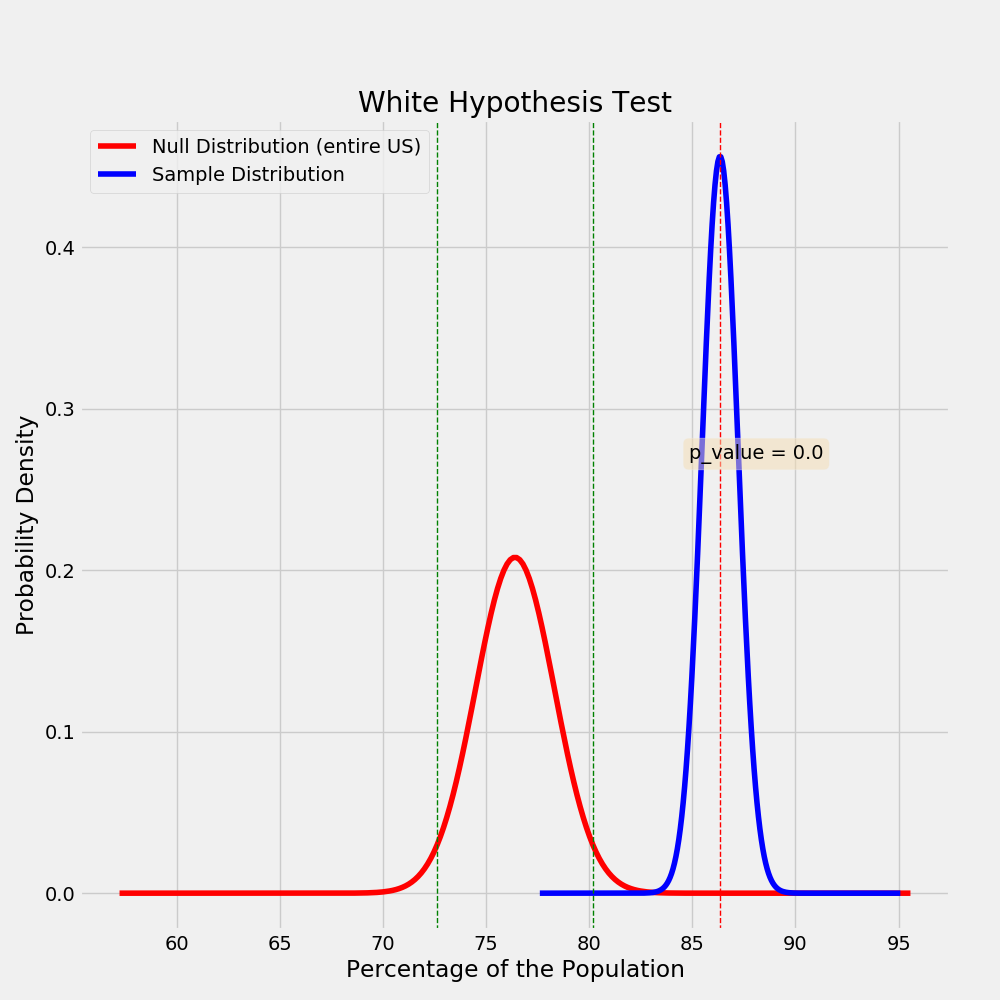

It appears that the people who are visiting O'Haver Lake are whiter and more male than the national average.  <br>
But, what we can do with this is limited.. 
Is there something about this campsite that attracts white men or is there something about the campsite that attracts Coloradans? Remember most of its visitors are from Colorado. 


## Conclusion

Overall, it is hard to come to many if any conclusions from the analysis of Mesa Verde National Park and O'Haver. Most of my sample distributions for different census variables were in line with national averages. The ones that were different have to be treated with scrutiny. It is very easily to conflate different variables and confuse causation and correlation in this type of analysis. Just look at O'Haver Lake. 

However, I was able to acomplish my second goal. I developed a pipeline that created a new database taking data from reservations.csv and the census api. This type of pipeline will be very useful for other projects, especially a pipeline that draws from the census api. The pipeline could also be useful for recreation.gov with more specific data about their clientele, more specific inqueries, and a campsite in question. With my pipeline and a campsite name, you are only a couple clicks (or ENTERS) away from a wealth of demographic information


## Sources


https://www.census.gov/data/developers/data-sets/acs-migration-flows.html


https://ridb.recreation.gov/download

